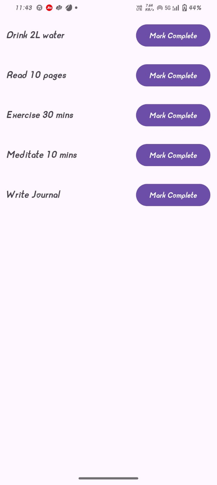
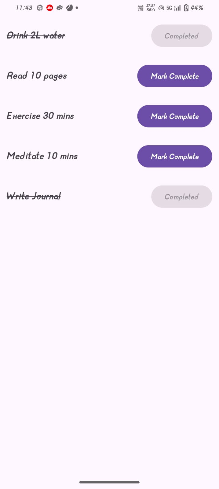

# 📌 Habit Tracker App

A simple Habit Tracker App built in Android (Kotlin + XML) to practice RecyclerView, Adapters, and OOP concepts.

This app allows users to add and view daily habits in a scrollable list, showcasing how to implement RecyclerView with a custom Adapter.

# 🚀 Features

Add new habits (title, description, or frequency)

Display habits in a clean RecyclerView list

Uses a Habit class to model habit objects (OOP practice)

HabitAdapter handles binding of data to RecyclerView

# Minimal UI for learning purposes

🛠️ Tech Stack

Language: Kotlin

UI: XML Layouts

# Core Android Concepts:

RecyclerView

Custom Adapter (HabitAdapter)

ViewHolder pattern

OOP (Habit class with properties & constructors)

# 📂 Project Structure

├── MainActivity.kt / HabitActivity.kt   # Entry point, sets up RecyclerView

├── Habit.kt                             # Data class representing a habit

├── HabitAdapter.kt                      # RecyclerView Adapter

└── res/layout/                          # XML layouts for activity and habit items

      ├── activity_habit.xml             # Main layout
      
      └── item_habit.xml                 # Layout for a single habit row
      

# 📸 Screenshots 

### RECYLCERVIEW SCREEN

### SCREEN AFTER MARKED COMPLETED

	
# 📖 Learning Outcome

This project helped me understand:

How RecyclerView works

Writing a custom adapter for handling lists

Creating and using a data class (Habit)

Applying OOP principles in Android apps

# ⚡ How to Run

Clone this repository  https://github.com/suhaniranka006/Habit_Tracker_Lite_App.git

Open in Android Studio

Run the app on an emulator or physical device

# 🙌 Future Improvements

Add Room database to persist habits

Implement edit/delete habit functionality

Improve UI with Material Design components
